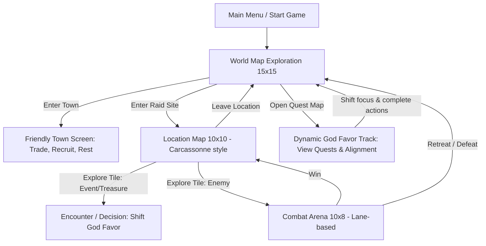

# Sons of the Fjords: Game Design Brainstorm

Welcome to the brainstorming phase of **Sons of the Fjords**, a Norse-themed, tactical-exploration static web application. Below is a detailed structural and mechanic proposal based on your pitch.

---

## 1. Game Flow & Core Loop



---

## 2. World Map Mechanics (15x15 Grid)

The world map represents the coastal fjords, islands, and harsh northern seas.
*   **Movement**: Grid-based navigation (ortho/diagonal or hex-style, though standard grid is simplest for a 15x15 map).
*   **Fog of War**: Initially covered in fog, revealed as your Drakkar (longship) or party sails/walks.
*   **Tile Types**:
    *   `Sea/Fjord`: Navigation lane for your Drakkar.
    *   `Sand/Shore`: Landings where you transition from ship to foot.
    *   `Grasslands`: Easy travel, common animals/encounters.
    *   `Forests`: Higher ambush risk, wood resources.
    *   `Snow/Tundra`: Harsh conditions, slows movement unless upgraded.
    *   `Mountains`: Impassable borders containing valuable caves.
*   **Locations**:
    *   **Towns (Friendly)**: Trade loot, buy supplies (rations, wood, iron), and hire soldiers (Shieldmaidens, Berserkers, Archers).
    *   **Raid Sites (Hostile)**: Monasteries, enemy camps, burial mounds, and caves.

---

## 3. Location Exploration (10x10 Carcassonne-style)

When entering a location, you zoom in from the World Map to a 10x10 sub-grid.
*   **The Carcassonne Mechanic**:
    *   You start on a single starting tile (e.g., shore/landing).
    *   All other tiles are face down (fog).
    *   When you move to an edge, a tile is **drawn from a randomized deck** (tile stack) and placed adjacent, revealing the terrain.
    *   *Rules for placement*: Drawn tiles must match adjacent terrain edges (e.g., a path connects to a path, water to water, forest to forest). This creates a unique procedural layout every time.
*   **Deck Composition**:
    *   The tile stack is generated based on the world map tile type.
    *   *Example*: A cave in the Mountains will have a deck filled with Rock, Cave Chambers, and Ore Vein tiles. A monastery in the Grasslands will have Meadows, Roads, and Buildings.
*   **Tile Contents**:
    *   **Empty**: Safe travel.
    *   **Treasure**: Gold, weapons, artifacts.
    *   **Event**: Text-based decisions with skill checks (e.g., solving a dispute, repairing a bridge).
    *   **Enemies**: Blocks path, forces transition to the Combat Map.

---

## 4. Tactical Lane-Based Combat (10x8 Arena)

A tactical chess-like or lane-defense-like combat sub-map.
*   **Layout**: 10 columns by 8 rows.
*   **Lanes**: 8 horizontal lanes.
*   **Starting Positions**:
    *   Your Viking party deploys on the far-left (Columns 1–2).
    *   Enemies deploy on the far-right (Columns 9–10).
*   **Combat Flow**:
    *   **Turn-Based Grid Tactics**: Units have Speed, Attack Range, Health, and Attack Power.
    *   **Lane Actions**: Units advance along lanes, block enemies, or shoot projectiles across lanes (archers/casters).
    *   **Class Archetypes**:
        *   *Shieldmaidens*: High defense, can shield units in adjacent lanes.
        *   *Berserkers*: High damage, gain power when low on health, advance rapidly.
        *   *Huntsmen (Archers)*: Range 4-5 lanes, low health.
        *   *Seidr Casters*: Cast buffs/debuffs or lightning strikes across lanes.

---

## 5. Quest & The Dynamic 5-God Alignment System

Rather than selecting a single god at the start, the player's alignment is fluid. You navigate the world and complete quests/actions, which dynamically shifts your standing. 

### Dynamic Favor Mechanics
*   **Favor Levels**: Each of the 5 gods has a favor tracker (e.g., from -5 to +5 or a numeric scale).
*   **Fluid Allegiance**: You can complete quests for Odin, earn some buffs, and then pivot to Loki. You keep the buffs from Odin's unlocked tiers, but starting to please Loki will shift the balance.
*   **Opposing Shift**: The gods exist in a pentagram of alignment. Gaining favor with one god automatically drains favor from the **two gods on the opposite side** of the wheel (antagonization).
*   **Permanent Debuffs**: If a god's favor drops into negative tiers, you suffer active debuffs/penalties from that god's wrath, which persist until you work to appease them.

```
       [Odin]
      /      \
  [Loki]    [Thor]
     \       /
    [Hel]--[Freya]
```

### The Pentagram Alignment Rules
When you perform actions that please a God, your favor with them increases. However, you antagonize the **two gods on the opposite side** of the pentagram.

| Favored God | Primary Theme / Quest Focus | Opposed Gods (Antagonized) | Buffs / Powers Granted (Favor > 0) | Wrath / Debuffs (Favor < 0) |
| :--- | :--- | :--- | :--- | :--- |
| **Odin** (Allfather) | Seek runes of wisdom, sacrifice wealth/units for knowledge. | **Freya** & **Hel** | Map reveal bonuses, XP boosts, Seidr magic resistance. | Fog of war thickens, random unit confusion in battles. |
| **Thor** (Thunderer) | Defeat mighty monsters, challenge bosses in direct combat. | **Hel** & **Loki** | Combat damage buffs, lightning strikes in battles. | Storms hit Drakkar on sea tiles, decreasing speed/health. |
| **Freya** (Folk-ruler) | Trade, rescue captives, build settlements, preserve nature. | **Loki** & **Odin** | Unit healing, cheaper recruiting costs, high morale. | High town prices, lower unit starting morale. |
| **Hel** (Underworld) | Ransack tombs, use necromancy, embrace sacrifice. | **Odin** & **Thor** | Resurrect fallen soldiers as Draugr, poison damage attacks. | Unlocked soldiers can die permanently or start combat decayed. |
| **Loki** (Trickster) | Sabotage, steal, use stealth, complete tricky choices. | **Thor** & **Freya** | High critical strike chance, avoidance of traps/ambushes, illusions. | Traps trigger more frequently, enemies get ambush priority. |

---

## 6. Proposed Technical Architecture

Since this is a static web application, we want it to be highly responsive, performant, and self-contained.

### Options for Setup:
1.  **Vite + React + TypeScript (Highly Recommended)**:
    *   *Why*: Managing complex game state (World Map grid, Location deck/Carcassonne logic, Combat units/health, God Favor stats) is extremely error-prone in Vanilla JS. React provides clean state synchronization.
    *   *Styling*: Custom CSS with CSS variables for the Norse/Runic theme.
2.  **Vanilla HTML5 + JS (ES6 modules) + Custom Canvas/DOM**:
    *   *Why*: Simplest stack, zero build step required if run directly in browser.
    *   *Downside*: Writing custom state-to-DOM sync for three different grids (15x15, 10x10, 10x8) is complex and verbose.

---

## 7. Aesthetics & User Interface

To deliver a premium, premium feel:
*   **Theme**: *Nordic Dark Mode*. Deep charcoal/stone backgrounds, glowing runic accents (teal, gold, and cold blue), glassmorphic windows with frosted edges.
*   **Typography**: Using Google Fonts like **MedievalSharp** (for headings/runic style) and **Cinzel** or **Outfit** (for interface clean text).
*   **Visual Assets**: High-quality SVG assets or custom-generated pixel art/illustrations representing tiles, icons (runes, weapons), and character avatars.
*   **Micro-interactions**: Hover effects where runes glow, screen transitions that fade/slide like mist, and smooth board-tile placement animations when discovering Carcassonne tiles.

---

## 8. Game State & Data Models

To support multiple active parties and save/resume functionality, the application state is partitioned into clean, serializable models:

### A. World Map State
```typescript
interface WorldMapState {
  tiles: WorldTile[][];        // 15x15 grid of terrain types
  revealed: boolean[][];       // Fog of war matrix
  locations: {                 // Coordinates of Towns & Raid Sites
    [locationId: string]: {
      x: number;
      y: number;
      type: 'town' | 'raid';
      name: string;
      terrain: string;         // World map terrain it resides on
    }
  };
}
```

### B. Location Map State
Each location maintains its own state after discovery, so elements (like defeated/remaining enemies, placed tiles, and the generated tile stack) persist when you leave and return.
```typescript
interface LocationMapState {
  [locationId: string]: {
    isDiscovered: boolean;
    isCleared: boolean;
    placedTiles: {             // 10x10 coordinate grid of discovered tiles
      [coordKey: string]: {    // e.g., "x,y"
        terrainType: string;
        revealed: boolean;
        entity?: Entity;       // Enemy, Chest, Event details
      }
    };
    tileStack: string[];       // Array of terrain names remaining to be drawn
  }
}
```

### C. Party State
Separating party details from global state allows for multiple parties playing in the same world.
```typescript
interface PartyState {
  [partyId: string]: {
    name: string;
    position: {
      worldX: number;
      worldY: number;
      currentLocationId: string | null; // null if on World Map
      localX: number;                   // 10x10 local coord if inside a location
      localY: number;                   // 10x10 local coord if inside a location
    };
    resources: {
      gold: number;
      rations: number;
      wood: number;
      iron: number;
    };
    soldiers: Soldier[];
    inventory: Item[];
    godFavor: {               // Favor score for each deity (-5 to +5)
      odin: number;
      thor: number;
      freya: number;
      hel: number;
      loki: number;
    };
    activeQuests: {
      [questId: string]: QuestProgress;
    };
  }
}
```

### D. Global Game State
```typescript
interface GlobalState {
  worldMap: WorldMapState;
  locations: LocationMapState;
  parties: PartyState;
  activePartyId: string;
  gameTime: {                 // Days passed
    day: number;
  };
}
```

---

## 9. Game Database Specs & Content Dictionary

Here is a proposed content dictionary defining the core entities and states within the game.

### A. World Map Location Classes
Locations on the 15x15 map fall into two primary categories:

1. **Friendly Towns (Kaufang)**
   - **Trade Outpost**: High selection of basic resources (rations, wood, iron). Sells common equipment.
   - **Great Hall**: Tavern to recruit elite warriors (Berserkers, Huscarls) and restore party morale.
   - **Seidr Sanctuary**: Shrine to cleanse curses, purchase potions, and recruit support mages.
   - **Shipyard**: Upgrade/repair Drakkar stats (movement speed, cargo size, hull health).

2. **Raid Sites (Hostile)**
   - **Monastery**: Rich silver and relic loot, guarded by weak Monks and Guards. Pleases Loki/Odin, angers Freya.
   - **Coastal Village**: High supplies and leather, guarded by local Milita. Pleases Loki/Thor, angers Freya.
   - **Burial Mound (Draugr Tomb)**: Ancient weapons and runes, guarded by undead Draugr. Pleases Hel, angers Thor/Odin.
   - **Mountain Cave**: Abundant iron/raw ore, guarded by Cave Trolls. Pleases Thor, angers Loki.
   - **Ruin Keep**: Mythic items and traps, guarded by Frost Giants or Outlaw Vikings. Pleases Odin, angers Loki.

---

### B. Location Map Terrains (10x10 Carcassonne Cells)
These are drawn procedural tiles:
- **Sea / Shore**: Drakkar landing zones. Restricts movement unless starting from a ship.
- **Meadow / Plain**: Basic terrain. Normal movement cost. Low defense values in combat.
- **Deep Forest**: High defense (cover). Obstructs ranged lines of sight. Ambush danger.
- **Rocky Pathway**: Narrow lane bottlenecks.
- **Cave Passage**: Reduced visibility (fog of war only reveals adjacent 1-tile radius instead of 2).
- **Ice Field / Glacier**: Slippery movement (units slip or slide), slow terrain traversal.
- **Fortified Gate**: Obstacle requiring siege or a lockpick check (Loki favor / tools).

---

### C. Soldier Types (Roster Classes)
Soldiers possess stats: Class, Max HP, Current HP, Damage, Range, Speed, and Abilities.
- **Shieldmaiden**: Tank. *Ability*: Shield Wall (absorbs damage for adjacent lanes). High Armor.
- **Berserker**: Shock Trooper. *Ability*: Frenzy (gains attack damage proportional to missing HP). Fast movement.
- **Huntsman**: Ranged Physical. *Ability*: Poison Arrow (deals damage over time across lanes). Low Armor.
- **Seidr Weaver**: Support Mage. *Ability*: Fate Weaver (heals units or applies shielding runes).
- **Huskarl**: Heavy Melee. *Ability*: Shield-Breaker (shreds opponent defense/shields).
- **Scout / Pathfinder**: Utility. *Ability*: Farsight (reveals adjacent Carcassonne tiles from 2 spaces away).

---

### D. Enemies
Enemies spawn based on the location type:
- **Saxon Monk / Peasant**: Very low HP, weak melee, flees when morale drops.
- **Saxon Shield-Guard**: High armor, blocks lanes.
- **Undead Draugr**: Medium health, rises once after defeat with 25% HP (unless slain by Seidr magic).
- **Fenrir Pack Wolf**: High speed, leaps across lanes to attack weak backline units.
- **Cave Troll**: Boss class. Massive HP, slow, deals area damage sweeping multiple lanes.
- **Frost Giant (Jotunn)**: Boss class. Deals frost damage that slows attack speed and freezes units.

---

### E. Resources
- **Silver (Viking wealth)**: Used for trade, hiring recruits, and town services.
- **Rations**: Consumed automatically during World Map travel. If zero, party takes starvation damage and morale drops.
- **Raw Iron**: Used by smithies to upgrade soldier equipment.
- **Timber (Wood)**: Used to repair the Drakkar and construct base shelters.

---

### F. Objects & Artifacts (Inventory System)
Items fit into three distinct sub-types:
1. **Gear (Equippable)**:
   - *Saxon Broadsword*: (+Attack)
   - *Iron Chainmail*: (+Armor)
   - *Longbow*: (+Range)
2. **Consumables (Single-use)**:
   - *Mead Horn*: Boosts combat morale / damage for 1 battle.
   - *Valkyrie Herb*: Revives a fallen soldier post-battle.
3. **Deity Artifacts (Legendary Passive items)**:
   - *Shard of Gungnir*: Odin's favor. Attacks never miss and pierce armor.
   - *Mjolnir's Core*: Thor's favor. Attacks have a 25% chance to trigger chain lightning.
   - *Freya's Amber Tear*: Automatically revives a fallen soldier during battle once.
   - *Hel's Urn of Ash*: Defeated enemies occasionally rise as friendly Draugr.
   - *Loki's Trickster Coin*: Allows re-rolling a failed event skill check.

---

### G. God Alignment Quest Lines & Favor Tiers
Favor is tracked on a numeric spectrum from **-5 to +5**:

| Tier | Status | Effect State |
| :--- | :--- | :--- |
| **+5** | *Chosen Champion* | Legendary Artifact Unlock + Ultimate Passive (e.g., Thor: All hits deal +5 lightning damage). |
| **+3 to +4** | *Blessed* | Major Passive Buffs (e.g., Freya: Double healing effectiveness in camps). |
| **+1 to +2** | *Favored* | Minor Buffs (e.g., Odin: Reveal all town locations on the world map). |
| **0** | *Neutral* | Standard baseline. |
| **-1 to -2** | *Disliked* | Minor Debuffs (e.g., Hel: Rations rot 10% faster). |
| **-3 to -4** | *Angered* | Major Debuffs / Divine Hazards (e.g., Thor: Random lightning strikes in ship travel). |
| **-5** | *Cursed* | Divine Curse active (e.g., Loki: Units randomly attack allies due to illusions). |

#### Quest Generation Mechanics
Quests are linked to dynamic event milestones. For instance:
- **Odin's Quest (The Wisdom Quest)**: Retrieve Runic Tablets hidden in Tomb Ruins. (Requires choosing wisdom/sacrifice options in events).
- **Thor's Quest (The Giant Slayer)**: Slay a Jotunn in a Cave Dungeon.
- **Freya's Quest (The Peace Weaver)**: Secure trade agreements with 3 towns and free captive slaves from raids.
- **Hel's Quest (The Gravekeeper)**: Sacrifice silver at a burial mound and leave fallen soldiers behind.
- **Loki's Quest (The Mischief Quest)**: Steal relics from Monasteries without triggering combat (using stealth options).


