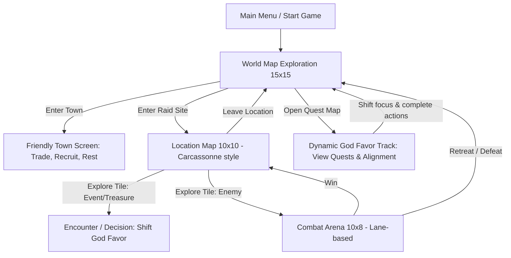

# Sons of the Fjords: Game Design Brainstorm

Welcome to the brainstorming phase of **Sons of the Fjords**, a Norse-themed, tactical-exploration static web application. Below is a detailed structural and mechanic proposal based on your pitch.

---

## 1. Game Flow & Core Loop



---

## 2. World Map Mechanics (15x15 Grid)

The world map represents the coastal fjords, islands, and harsh northern seas.
*   **Movement**: Grid-based navigation on a 15x15 map.
*   **Fog of War**: Covered in fog, revealed as you sail or walk.
*   **Sailing vs. Land Travel**:
    *   `Sea/Water Travel`: Navigation by Drakkar (longship). Very fast, low resource cost (minimal food consumed), and completely safe from random combat encounters (unless under a god's curse).
    *   `Land Travel` (Plains, Rivers, Forests, Snow, Mountains): Traveling on foot. Slower, incurs a higher food cost, and triggers random combat encounters against monsters.
    *   `Seamless Boarding`: Transitioning between ship and foot is seamless. You can land on shore tiles or board the Drakkar at any point; you do not need to keep track of where a physical ship is parked.
*   **Tile Types**:
    *   `Sea/Water`: Fast, safe sailing.
    *   `Plains`: Flat lands, standard walking speed.
    *   `Rivers`: Barriers that slow movement or require crossing points.
    *   `Forests`: Wooded areas with high ambush risk.
    *   `Snow`: Frost lands, slow travel.
    *   `Mountains`: Hard terrain containing caverns and caves.
*   **Locations**:
    *   **Towns (Friendly)**: Trade resources, buy equipment, and recruit soldiers.
    *   **Raid Sites (Hostile)**: Dungeons, tombs, and monster dens.

---

## 3. Location Exploration (10x10 Carcassonne-style)

When entering a location, you zoom in from the World Map to a 10x10 sub-grid.
*   **The Carcassonne Mechanic**:
    *   You start on a single starting tile (e.g., shore/landing).
    *   All other tiles are face down (fog).
    *   When you move to an edge, a tile is **drawn from a randomized deck** (tile stack) and placed adjacent, revealing the terrain.
    *   *Rules for placement*: Drawn tiles must match adjacent terrain edges (e.g., a path connects to a path, water to water, forest to forest). This creates a unique procedural layout every time.
        *   *(Note for future expansion: Tiles can also have edge blockades/walls on one or more boundaries. If an edge has a blockade, units cannot traverse between the two adjacent tiles. These edge blockades are represented as either `Mountain` (rock wall) or `Chasm` (canyon split) boundaries).*
*   **Deck Composition**:
    *   The tile stack is generated based on the world map tile type.
    *   *Example*: A location in a Forest tile on the World Map will have a location deck composed mostly of Forest, Grass, and River/Water tiles. A cave location in a Mountain tile will consist primarily of Rock, Cave, Mountain, and Chasm tiles.
*   **Tile Contents**:
    Tiles can contain interactable entities on top of their base terrain:
    *   **Empty / Clear**: Safe passage.
    *   **Enemy Army**: A pack of specific monsters blocking the path. Defeating them transitions back to the map.
    *   **Treasure**: Chests yielding Silver, materials, or equipment.
    *   **Cave Entrance**: Leads into cave grids containing monsters and minerals.
    *   **Burial Mound**: Tomb chambers containing ancient bones, undead, or ancient Norse relics.
    *   **Dolmen / Druid Sanctuary**: Sacred standing stones. Interacting with them often rewards the player with ancient **Magic Objects** needed to please the Gods.
*   **Leaving a Location**:
    *   You do not need to walk back to the starting tile to exit a location map. You can exit directly via a menu option at any time, returning to the World Map.
*   **Combat Defeat**:
    *   If all your deployed soldiers and those remaining in your deployment pool die, you lose the combat. 
    *   Losing combat forces your party out of the battle and back to the location map. The player is not forced to return to town immediately, but having lost their entire army, they must travel back to a friendly town to recruit new soldiers.

---

## 4. Tactical Lane-Based Combat (10x8 Arena)

A tactical, automated lane-defense combat sub-map.
*   **Layout**: 10 columns by 8 rows (8 horizontal lanes).
*   **Auto-Advance**: Units automatically advance forward along their lanes. When opposing units meet, they stop and battle.
*   **Deployment Pool**: 
    *   You maintain a pool (or hand) of soldiers at all times. You do not have to deploy all units at the beginning of combat.
    *   You can deploy a unit from your pool into any lane at any time by pressing a deployment button.
    *   Deploying units **pauses the combat phase**, allowing you to carefully select the lane and place the soldier.
*   **Combat Victory (Reaching the Far Right)**:
    *   If one of your soldiers successfully reaches the far right (column 10, the enemy end), you gain **+1 gold**.
    *   The unit is removed from the board and returned to your deployment pool, ready to be redeployed.
*   **Combat Breach (Enemy Reaching the Far Left)**:
    *   If an enemy unit successfully reaches the far left (column 1, your side), they breach your line.
    *   You lose a random selection of resources (Gold, Food, Wood, or Sheep).
*   **Permadeath**:
    *   If a soldier's HP drops to 0 in combat, they die permanently. They are removed from the board and your party roster forever.
*   **Roster Classes (Prototype)**:
    *   *Shieldmaidens*: High defense, can shield units in adjacent lanes.
    *   *Berserkers*: High damage, gain power when low on health, advance rapidly.
    *   *Huntsmen (Archers)*: Range 4-5 lanes, low health.

---

## 5. Quest & The Dynamic 5-God Alignment System

Rather than selecting a single god at the start, the player's alignment is fluid. You navigate the world and complete quests/actions, which dynamically shifts your standing. 

### Universal Quest Progression
*   **Global Milestones**: Quests are universal and not tied to physical locations.
*   **5-Step Progress Track**: Each God has a progression track of **5 milestones** (moving left-to-right).
*   **Advancement**: Fulfilling a god's milestone conditions (such as turning in their specific magic objects or resolving event decisions in their favor) advances your progress bar for that deity and grants favor levels.

### Dynamic Favor Mechanics
*   **Favor Levels**: Each of the 5 gods has a favor tracker (from -5 to +5).
*   **Fluid Allegiance**: You can complete quests for Odin, earn some buffs, and then pivot to Loki. You keep the buffs from Odin's unlocked tiers, but starting to please Loki will shift the balance.
*   **Opposing Shift**: The gods exist in a pentagram of alignment. Gaining favor with one god automatically drains favor from the **two gods on the opposite side** of the wheel (antagonization).
*   **Milder Debuffs**: If a god's favor drops into negative tiers, you suffer active debuffs/penalties from that god's wrath, which are milder nuisances compared to the powerful positive alignment buffs.

```
       [Odin]
      /      \
  [Loki]    [Thor]
     \       /
    [Hel]--[Freya]
```

### The Pentagram Alignment Rules
When you perform actions that please a God, your favor with them increases. However, you antagonize the **two gods on the opposite side** of the pentagram.

| Favored God | Primary Theme / Quest Focus | Opposed Gods (Antagonized) | Buffs / Powers Granted (Favor > 0) | Wrath / Debuffs (Favor < 0) |
| :--- | :--- | :--- | :--- | :--- |
| **Odin** (Allfather) | Seek runes of wisdom, sacrifice wealth/units for knowledge. | **Freya** & **Hel** | Map reveal bonuses, XP boosts, Seidr magic resistance. | Fog of war thickens, random unit confusion in battles. |
| **Thor** (Thunderer) | Defeat mighty monsters, challenge bosses in direct combat. | **Hel** & **Loki** | Combat damage buffs, lightning strikes in battles. | Storms hit Drakkar on sea tiles, decreasing speed/health. |
| **Freya** (Folk-ruler) | Trade, rescue captives, build settlements, preserve nature. | **Loki** & **Odin** | Unit healing, cheaper recruiting costs, high morale. | High town prices, lower unit starting morale. |
| **Hel** (Underworld) | Ransack tombs, use necromancy, embrace sacrifice. | **Odin** & **Thor** | Resurrect fallen soldiers as Draugr, poison damage attacks. | Unlocked soldiers can die permanently or start combat decayed. |
| **Loki** (Trickster) | Sabotage, steal, use stealth, complete tricky choices. | **Thor** & **Freya** | High critical strike chance, avoidance of traps/ambushes, illusions. | Traps trigger more frequently, enemies get ambush priority. |

---

## 6. Proposed Technical Architecture

Since this is a static web application, we want it to be highly responsive, performant, and self-contained.

### Options for Setup:
1.  **Vite + React + TypeScript (Highly Recommended)**:
    *   *Why*: Managing complex game state (World Map grid, Location deck/Carcassonne logic, Combat units/health, God Favor stats) is extremely error-prone in Vanilla JS. React provides clean state synchronization.
    *   *Styling*: Custom CSS with CSS variables for the Norse/Runic theme.
2.  **Vanilla HTML5 + JS (ES6 modules) + Custom Canvas/DOM**:
    *   *Why*: Simplest stack, zero build step required if run directly in browser.
    *   *Downside*: Writing custom state-to-DOM sync for three different grids (15x15, 10x10, 10x8) is complex and verbose.

---

## 7. Aesthetics & User Interface

To deliver a premium, premium feel:
*   **Theme**: *Nordic Dark Mode*. Deep charcoal/stone backgrounds, glowing runic accents (teal, gold, and cold blue), glassmorphic windows with frosted edges.
*   **Typography**: Using Google Fonts like **MedievalSharp** (for headings/runic style) and **Cinzel** or **Outfit** (for interface clean text).
*   **Visual Assets**: High-quality SVG assets or custom-generated pixel art/illustrations representing tiles, icons (runes, weapons), and character avatars.
*   **Micro-interactions**: Hover effects where runes glow, screen transitions that fade/slide like mist, and smooth board-tile placement animations when discovering Carcassonne tiles.

---

## 8. Game State & Data Models

To support multiple active parties and save/resume functionality, the application state is partitioned into clean, serializable models:

### A. World Map State
```typescript
interface WorldMapState {
  tiles: WorldTile[][];        // 15x15 grid of terrain types
  revealed: boolean[][];       // Fog of war matrix
  locations: {                 // Coordinates of Towns & Raid Sites
    [locationId: string]: {
      x: number;
      y: number;
      type: 'town' | 'raid';
      name: string;
      terrain: string;         // World map terrain it resides on
    }
  };
}
```

### B. Location Map State
Each location maintains its own state after discovery, so elements (like defeated/remaining enemies, placed tiles, and the generated tile stack) persist when you leave and return.
```typescript
interface LocationMapState {
  [locationId: string]: {
    isDiscovered: boolean;
    isCleared: boolean;
    placedTiles: {             // 10x10 coordinate grid of discovered tiles
      [coordKey: string]: {    // e.g., "x,y"
        terrainType: string;
        revealed: boolean;
        entity?: MapEntity;    // Placed interactables
      }
    };
    tileStack: string[];       // Array of terrain names remaining to be drawn
  }
}

type MapEntity =
  | { type: 'enemy_army'; monsters: { monsterClass: string; count: number }[]; isDefeated: boolean }
  | { type: 'treasure'; silver: number; items: string[]; isLooted: boolean }
  | { type: 'cave_entrance'; targetLocationId: string }
  | { type: 'burial_mound'; relicItemName: string; isExplored: boolean }
  | { type: 'dolmen'; magicObjectId: string; isVisited: boolean };
```
```

### C. Party State
Separating party details from global state allows for multiple parties playing in the same world.
```typescript
interface PartyState {
  [partyId: string]: {
    name: string;
    position: {
      worldX: number;
      worldY: number;
      currentLocationId: string | null; // null if on World Map
      localX: number;                   // 10x10 local coord if inside a location
      localY: number;                   // 10x10 local coord if inside a location
    };
    resources: {
      gold: number;
      food: number;
      wood: number;
      sheep: number;
    };
    band: Soldier[];           // Roster of hired soldiers/army
    inventory: Item[];         // List of items, objects, and artifacts collected
    godFavor: {               // Favor score for each deity (-5 to +5)
      odin: number;
      thor: number;
      freya: number;
      hel: number;
      loki: number;
    };
    activeQuests: {
      [questId: string]: QuestProgress;
    };
  }
}
```

### D. Global Game State
```typescript
interface GlobalState {
  worldMap: WorldMapState;
  locations: LocationMapState;
  parties: PartyState;
  activePartyId: string;
  gameTime: {                 // Days passed
    day: number;
  };
}
```

---

## 9. Game Database Specs & Content Dictionary

Here is a proposed content dictionary defining the core entities and states within the game.

### A. World Map Location Classes
Locations on the 15x15 map fall into two primary categories:

1. **Friendly Towns (Kaufang)**
   - **Trade Outpost**: High selection of basic resources (rations, wood, iron). Sells common equipment.
   - **Great Hall**: Tavern to recruit elite warriors (Berserkers, Huscarls) and restore party morale.
   - **Seidr Sanctuary**: Shrine to cleanse curses, purchase potions, and recruit support mages.
   - **Shipyard**: Upgrade/repair Drakkar stats (movement speed, cargo size, hull health).

2. **Raid Sites (Hostile)**
   - **Monastery**: Rich silver and relic loot, guarded by weak Monks and Guards. Pleases Loki/Odin, angers Freya.
   - **Coastal Village**: High supplies and leather, guarded by local Milita. Pleases Loki/Thor, angers Freya.
   - **Burial Mound (Draugr Tomb)**: Ancient weapons and runes, guarded by undead Draugr. Pleases Hel, angers Thor/Odin.
   - **Mountain Cave**: Abundant iron/raw ore, guarded by Cave Trolls. Pleases Thor, angers Loki.
   - **Ruin Keep**: Mythic items and traps, guarded by Frost Giants or Outlaw Vikings. Pleases Odin, angers Loki.

---

### B. Location Map Terrains (10x10 Carcassonne Cells)
These are drawn procedural tiles:
- **Grass**: Standard green meadows, normal movement cost.
- **Snow**: Ice and snowdrifts, slows movement, increases slippage.
- **Forest**: Densely packed trees, offers combat cover but blocks projectile lines of sight.
- **Rock**: Rugged boulder clusters, impassable except through pathways.
- **Cave**: Pitch dark passages, reduces local vision distance to 1 tile.
- **Mountain**: Massive stone cliffs, creates high-altitude vantage points or blocks paths.
- **Chasm**: A deep, yawning rift in the ground. Blocks all movement, acting as a visual contrast to mountains.
- **Water / Shore**: Requires bridges or drakkar landings.

*(Note: Glacier is removed as an option; Mountain and Chasm serve as primary terrain blockers).*

---

### C. Soldier Types (Roster Classes)
Initial prototype classes:
- **Shieldmaiden**: Tank. *Ability*: Shield Wall (absorbs damage for adjacent lanes). High Armor.
- **Berserker**: Shock Trooper. *Ability*: Frenzy (gains attack damage proportional to missing HP). Fast movement.
- **Huntsman**: Ranged Physical. *Ability*: Poison Arrow (deals damage over time across lanes). Low Armor.

/* COMMENTED FOR LATER EXPANSION:
- Seidr Weaver: Support Mage. Ability: Fate Weaver (heals units or applies shielding runes).
- Huskarl: Heavy Melee. Ability: Shield-Breaker (shreds opponent defense/shields).
- Scout / Pathfinder: Utility. Ability: Farsight (reveals adjacent Carcassonne tiles from 2 spaces away).
*/

---

### D. Enemies (Monster Focus)
Combat focuses on mythical monsters for the initial prototype.
- **Giant Brood-Spider**: Fast. *Ability*: Web spit (roots a target unit, disabling lane advance for 1 turn).
- **Fenrir Pack Wolf**: Swift lane-hopper. *Ability*: Ravage (leaps to the lowest-HP lane and attacks).
- **Draugr Warrior**: Undead. *Ability*: Reanimate (rises once after death with 25% HP).
- **Cave Troll**: Heavy mini-boss. *Ability*: Ground Slam (sweeps three lanes simultaneously, dealing high physical damage).
- **Frost Giant (Jotunn)**: Mythic boss. *Ability*: Freezing Aura (slows attack and movement speed in adjacent lanes).
- **Lindwurm**: Acidic serpent. *Ability*: Acid Spit (degrades armor values permanently during the combat phase).

/* COMMENTED FOR LATER EXPANSION (Human Enemies):
- Saxon Monk / Peasant: Low HP, runs away when morale is depleted.
- Saxon Shield-Guard: High armor, blocks lanes.
- Outlaw Viking: High critical strike, uses traps.
*/

---

### E. Resources
- **Gold**: The primary currency. Used to recruit soldiers, buy goods, repair the Drakkar, and pay for town services.
- **Food**: Vital supplies. Consumed automatically during travel on the World Map. If depleted, your band takes starvation damage and morale plummets.
- **Wood**: Building material. Used to repair your Drakkar (longship) and build camps.
- **Sheep**: Livestock. Acts as a valuable trading commodity, emergency food source, or sacrificial offerings to satisfy specific gods.

---

### F. Objects & Artifacts (Inventory System)
Items fit into three distinct sub-types:
1. **Gear (Equippable)**:
   - *Saxon Broadsword*: (+Attack)
   - *Iron Chainmail*: (+Armor)
   - *Longbow*: (+Range)
2. **Consumables (Single-use)**:
   - *Mead Horn*: Boosts combat morale / damage for 1 battle.
   - *Valkyrie Herb*: Revives a fallen soldier post-battle.
3. **Deity Artifacts & Magic Objects (Quest Focus)**:
   > [!IMPORTANT]
   > *Magic Objects do not grant direct buffs/stats to your soldiers.* Instead, their sole function is to be collected and dedicated/traded to the respective Norse Gods. By sacrificing these objects, you increase that god's favor, which indirectly unlocks passive divine buffs.

   - *Shard of Gungnir*: Dedicated to Odin. (Unlocks Odin favor).
   - *Mjolnir's Core*: Dedicated to Thor. (Unlocks Thor favor).
   - *Freya's Amber Tear*: Dedicated to Freya. (Unlocks Freya favor).
   - *Hel's Urn of Ash*: Dedicated to Hel. (Unlocks Hel favor).
   - *Loki's Trickster Coin*: Dedicated to Loki. (Unlocks Loki favor).

---

### G. God Alignment Quest Lines & Favor Tiers
Favor is tracked on a numeric spectrum from **-5 to +5**. 

> [!NOTE]
> *Antagonization (negative favor/cursed state) is milder and less severe than the positive favor tiers.* Debuffs represent minor nuisance curses, whereas the positive favor levels unlock major game-altering mechanics and story campaigns.

| Tier | Status | Effect State |
| :--- | :--- | :--- |
| **+5** | *Chosen Champion* | Legendary Artifact Unlock + Ultimate Divine Buff. |
| **+3 to +4** | *Blessed* | Major Passive Buffs. |
| **+1 to +2** | *Favored* | Minor Buffs. |
| **0** | *Neutral* | Standard baseline. |
| **-1 to -3** | *Disliked* | Minor Debuffs (e.g., Loki: Rations rot slightly faster due to trickery). |
| **-4 to -5** | *Wrath State* | Milder curse (e.g., Thor: Occasional lightning bolt striking a random spot during sailing). |

#### Norse Mythological Quest Lines (Positive Alignment Themes)

1. **Odin's Quest: "The Sacrifice for Runes" (Theme: Mimir's Well)**
   - *Story*: Odin seeks the ultimate wisdom of the world runes. You must travel to ancient burial sites, sacrifice silver or high-level units, and retrieve tablets of elder knowledge.
   - *Milestones*: Unlocks wisdom sight (removes fog of war from towns) and culminates in obtaining the *Shard of Gungnir*.

2. **Thor's Quest: "The Halls of Utgarda-Loki" (Theme: Trial of Illusions)**
   - *Story*: Thor journeys to the giant fortress of Utgarda-Loki to prove his strength. You must defeat giant monsters (Trolls, Jotunns) in direct lane combat, facing mirages and illusions that hide enemy stats.
   - *Milestones*: Unlocks chain-lightning combat buffs and culminates in forging the *Mjolnir's Core*.

3. **Freya's Quest: "The Necklace of the Brisings" (Theme: Beauty & Diplomacy)**
   - *Story*: Freya's golden necklace *Brisingamen* has been stolen. You must forge trade agreements, free captive thralls from monsters, and retrieve amber gems from forests.
   - *Milestones*: Unlocks high party morale, unit healing, and culminates in obtaining *Freya's Amber Tear*.

4. **Hel's Quest: "The Descent into Niflheim" (Theme: Balder's Soul)**
   - *Story*: To negotiate the release of souls from the underworld, you must explore dark caves and mounds, carrying out ritual offerings of defeat.
   - *Milestones*: Unlocks the ability to command undead Draugr units and culminates in *Hel's Urn of Ash*.

5. **Loki's Quest: "The Theft of Idunn's Apples" (Theme: Giants & Trickery)**
   - *Story*: Loki is forced to help the giant Thjazi steal the apples of youth. You must complete location events using stealth, steal items from ruins without combat, and trick boss monsters.
   - *Milestones*: Unlocks stealth options, high critical strike chances, and culminates in *Loki's Trickster Coin*.


